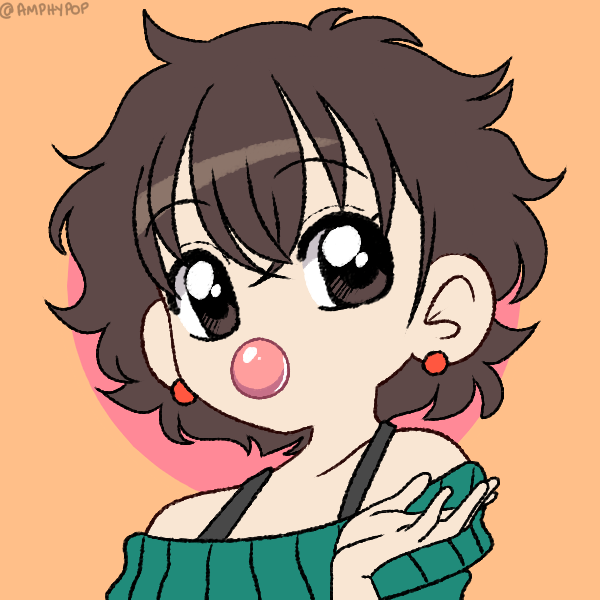

## Prazer, eu sou a Bárbara Zaidan! ✌️

### Estudo desenvolvimento web na Trybe e estou em transição de carreira da área de jornalismo
<div>
  
  <br>
  <p align="justify">
    Nasci em 1990, última década do milênio passado. Sou apaixonada por novidades, então estou sempre aprendendo algo novo, descobrindo lugares que eu nunca visitei, buscando experiências únicas e desafios para superar. 
    Na área de tecnologia, encontrei um ambiente que me proporciona tudo isso. Diariamente sinto-me desafiada a resolver um problema lógico, criar uma solução que proporciona novas experiências, aprender uma linguagem diferente. 
    Por meio do desenvolvimento web, desejo melhorar o ambiente em que vivemos.
  </p>
<div>


<br><br>

Aqui você confere uma visão geral da minha atividade no GitHub:
<div  style="display: flex">
  
  
</div>

<br><br>
E estas são minhas habilidades técnicas até o momento:
<br><br>

<div style="display: flex">
  
  
  
   
  
  
  
</div>

##

**Curiosidades sobre mim:**

```javascript
const curiosidades = ['amo filmes de animação', 'aprendi a nadar aos 30 anos', 'quero participar de uma maratona aquática', 'sou mãe de gato', 'a Família Adams me dá medo']
fatosCuriosos = () => curiosidades.forEach((curiosidade) => console.log(curiosidade));

fatosCuriosos();
```
### Entre em contato:
<div> 
   <a href="https://www.linkedin.com/in/barbara-valdez-zaidan/" target="_blank"></a> 
  <a href = "mailto:babivaldez@gmail.com"></a>
</div>
  
 ##

